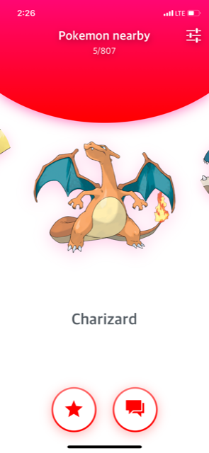

# BeastKeeper

> The worldʼs hottest new startup is BeastKeeper(Should be PokemonFinder). Home Page allow you to carousel of any nearby Pokemons.



## Demo

- Run with Expo: [BeastKeeper](https://expo.io/@cxchan/BeastKeeper)

## Technologies
- [React Native (Expo)](https://docs.expo.io/versions/latest/)

## Getting Started
Clone this repository
```
$ git clone git@github.com:cxchan1/BeastKeeper.git
```
Install node modules, [Yarn](https://yarnpkg.com/en/) is highly recommended.
```
$ cd BeastKeeper && yarn install
```
Open and start project using [Expo XDE](https://expo.io/tools) or use the [CLI](https://github.com/expo/exp) :
```
$ yarn start
```
Run on Android/iOS device or simulator
```
$ exp ios
$ exp android
```
## Install the App from Expo
If you don't want to build the App on your local machine or any other reasons then fear not, just download this app ios(https://itunes.apple.com/app/apple-store/id982107779) or android (https://play.google.com/store/apps/details?id=host.exp.exponent&referrer=www) and then either scan QR code or input your email/phone from this Expo link (https://expo.io/@cxchan/BeastKeeper) then you should able to access the App itself.

## Time

- 5 hours: Experiencing with Expo and coding the App
- 2 ~ 3 hours: Get the build release on Expo and Documentations(Image and Video)
